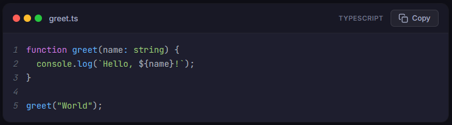

# CodePreview Component

A modern React component for displaying code snippets with syntax highlighting, line numbers, and one-click copy.

URL: https://dmalagueta.github.io/code-preview/



## Features

- Syntax highlighting for 200+ languages
- One-click copy with visual feedback
- Line highlighting to draw attention to specific code
- Configurable line numbers
- Responsive design for all screen sizes
- Accessible with ARIA labels and keyboard support
- macOS-style window chrome

## Installation

```bash
npm install
```

## Usage

Import the component and pass your code as a prop:

```tsx
import Codepreview from "./components/Codepreview";

const code = `function greet(name: string) {
  console.log("Hello, " + name);
}`;

<Codepreview
  code={code}
  filename="greet.ts"
  language="typescript"
  showCopyButton={true}
  highlightLines={[2]}
/>
```

## Props

| Prop | Type | Default | Description |
|------|------|---------|-------------|
| `code` | `string` | required | The code snippet to display |
| `filename` | `string` | — | Filename shown in the header bar |
| `language` | `string` | `"javascript"` | Language for syntax highlighting |
| `showCopyButton` | `boolean` | `true` | Show or hide the copy button |
| `highlightLines` | `number[]` | `[]` | Line numbers to highlight |
| `showLineNumbers` | `boolean` | `true` | Show or hide line numbers |

## Running the Project

```bash
npm run dev
```

## Deploying

```bash
npm run build && npm run deploy
```
